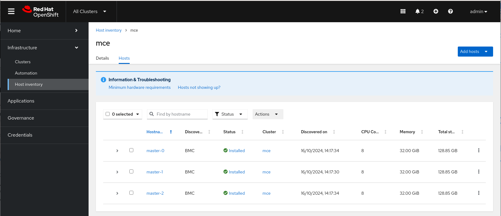
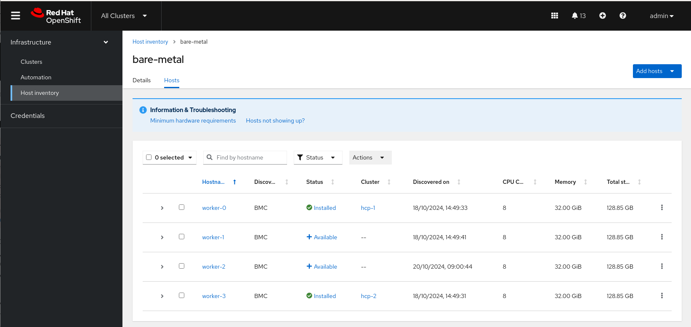
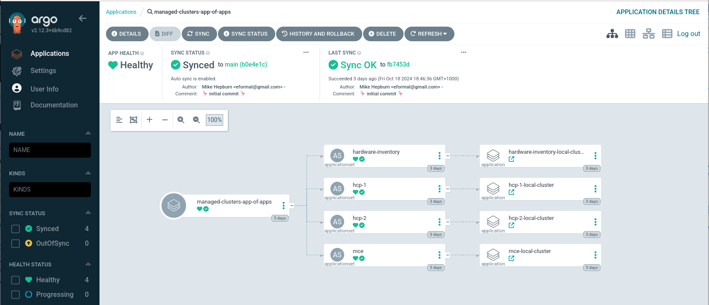
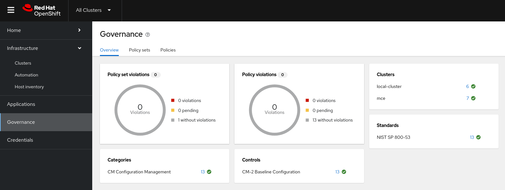

# acm-sno-lab

Bare Metal - ACM > MCE > HCP Spokes

    ACM - SNO Hub cluster
    MCE - Managed 3-Node Compact Hosting cluster
    hcp-{1..4} - Managed Spoke HCP clusters

Component View

Cluster Topology View

ACM > MCE > HCP auto-import

- Policy to auto-import HCP Spokes

ACM HUB Clusters

- Global Policy-as-code management via GitOps

MCE Clusters

- Lifecycle HCP Spokes via GitOps from ACM

InfraEnvs - MCE & BareMetal

GitOps Clusters

Policy-as-Code

## Useful Links

- https://github.com/stolostron/hypershift-addon-operator/blob/main/docs/discovering_hostedclusters.md
- https://github.com/stolostron/hypershift-addon-operator/blob/main/docs/hosting_cluster_topologies.md
- https://labs.sysdeseng.com/hypershift-baremetal-lab/4.15/hcp-deployment.html
