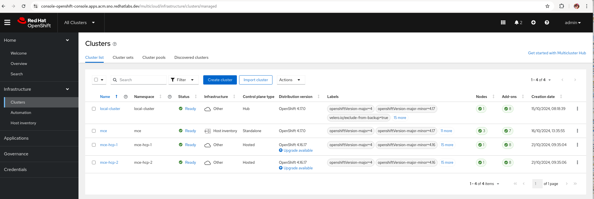
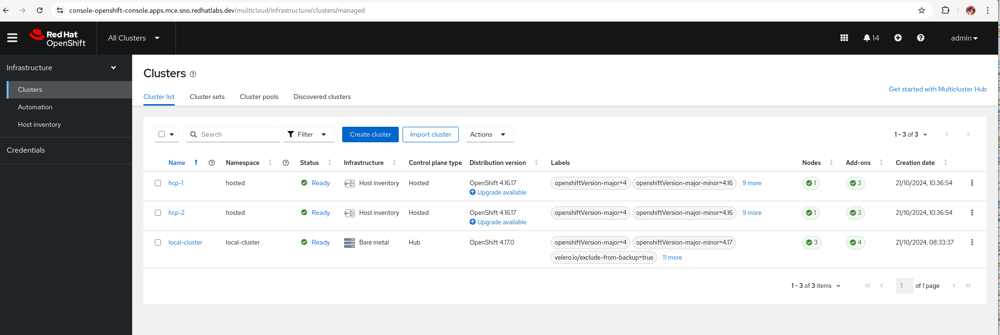

# acm-sno-lab

Bare Metal - ACM > MCE > HCP Spokes

    ACM - Hub cluster
    MCE - Managed Hosting cluster
    hcp-1, hcp-2 - Managed Spoke HCP clusters

Component View

Cluster Topology View

ACM > MCE > HCP auto-import

- Policy to auto-import HCP Spokes

ACM HUB Clusters

- Global Policy-as-code management via GitOps

MCE Clusters

- Lifecycle HCP Spokes via GitOps from ACM

